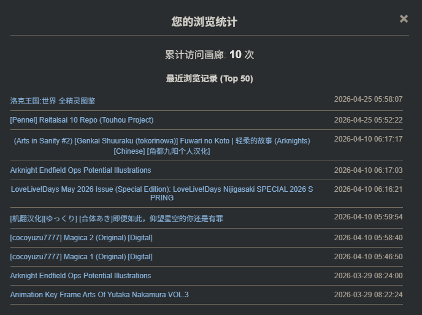
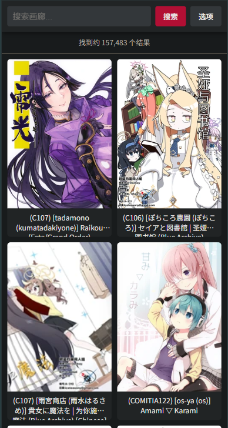
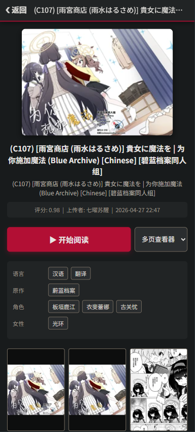
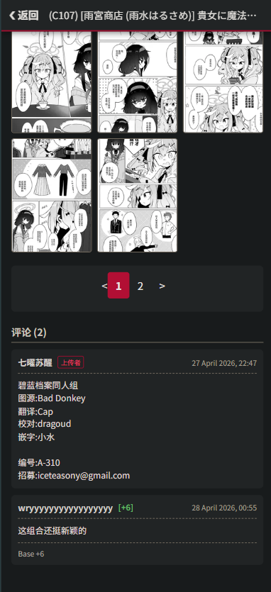
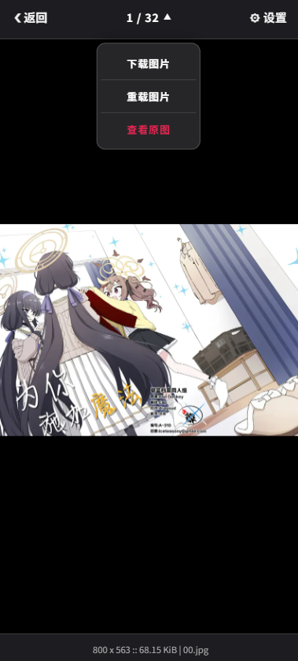
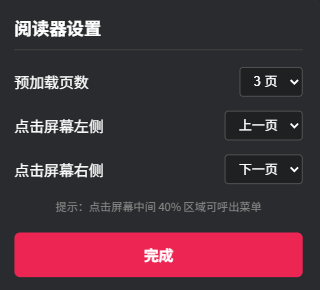

# exhentai 代理

代理 ex 方便没有 ex 站的用户浏览，默认屏蔽账号相关交互功能，并加入了一些小功能

## 启动

```bash
PORT=<PORT> ./exht-proxy
```

## 显示日志

```bash
SHOW_LOG=1 PORT=<PORT> ./exht-proxy
```

请在`.env`文件中写入cookie, 并按需配置屏蔽项目

## 功能

- 访问统计 (根据 IP 与浏览器指纹)



- 自定义移动视图 (画廊列表、详情、浏览界面)

<details>

<summary>画廊列表</summary>



</details>

<details>

<summary>画廊详情</summary>

| 画廊详情图 1 | 画廊详情图 2 |
| :---: | :---: |
|  |  |

</details>

<details>

<summary>浏览界面</summary>

| 浏览器图1 | 浏览器图2 |
| :---: | :---: |
|  |  |

</details>

### 已默认屏蔽

- 画廊下载(压缩 / 种子)
- 发布种子
- 用户设置
- 收藏
- 用户tag
- 举报画廊
- 评分(tag / 评论 / 画廊)
- 更改列表显示方式
- 评论

## 注意事项

每次启动时自动获取`igneous`, 请在欧美IP机器上部署

## TODO

- [x] 持久化访问统计
- [ ] 密码访问
- [ ] 速率限制
- [x] 网页界面汉化 & 搜索补全 (来自 [EhTagTranslation](https://github.com/EhTagTranslation/Database) )
- [ ] 个人收藏
